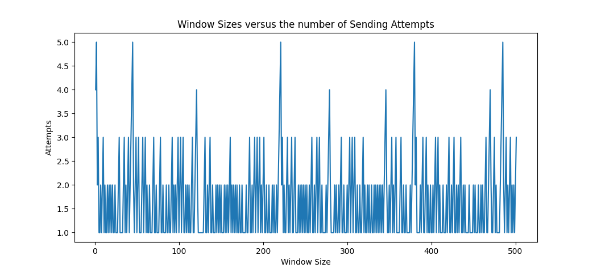
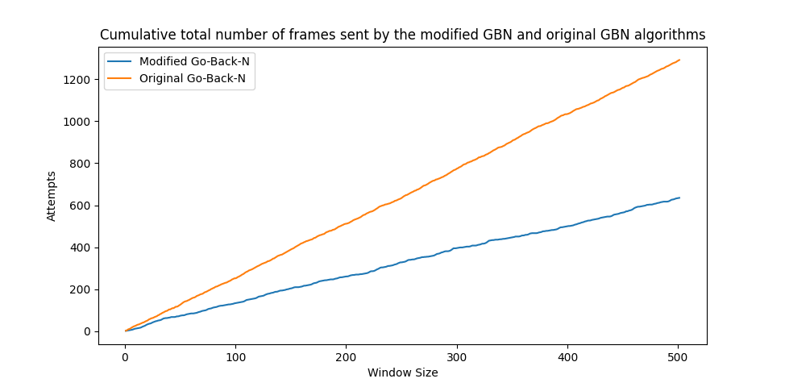
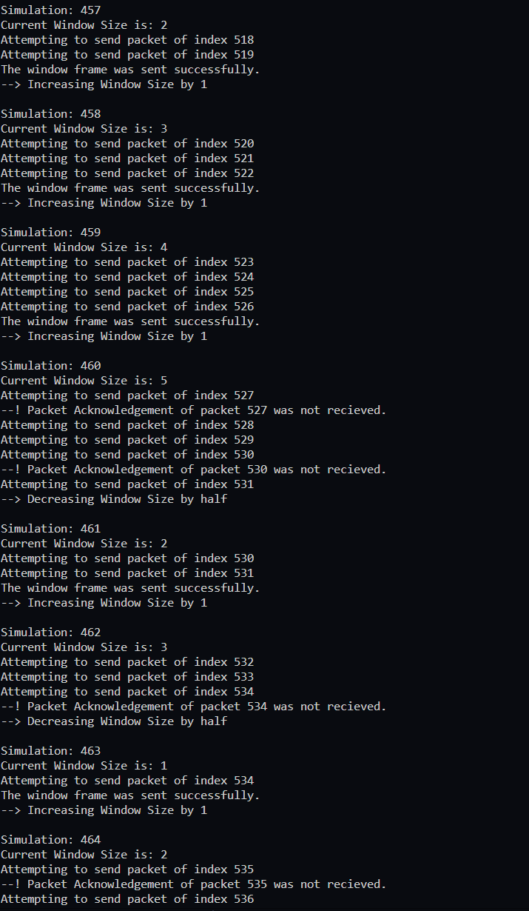
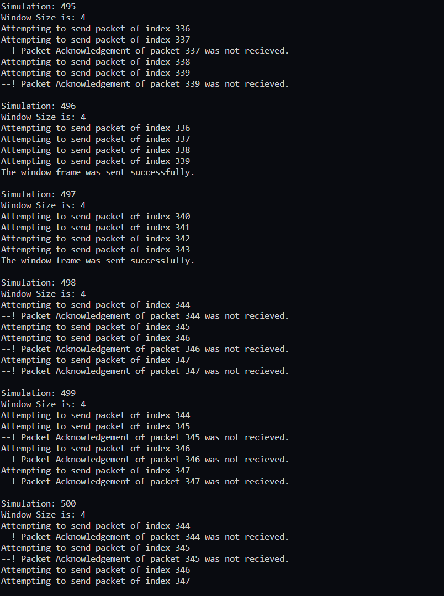

# GBN Protocol Simulation
This repository contains Python programs that simulate the Go-Back-N (GBN) protocol.

## Features
`modifiedGBN.py`: The program starts with the initial window size of 4. With every successful acknowledgement it increments the window size by 1 and with every frame loss it decreases the window size by half. Maximum allowed window size is 8 and minimum window size is 1. Then it creates a chart of `Window Size vs Number of Sending Attempts.`

`originalGBN.py:` Implements the original GBN protocol that always has a window size of 4. It always re-transmits the whole window of four frames if a packet loss happens. Then it creates a chart of `Original GBN vs Modified GBN`

## How to Run
Clone the repository to your local machine.

    git clone https://github.com/vmsaif/gbnProtocolSimulation.git

Navigate to the repository directory using your terminal.

Run the desired program.

    python src/modifiedGBN.py
or
    
    python src/originalGBN.py

## What I Have Learned
- The basics of the GBN protocol and how it works.
- How to simulate the GBN protocol in Python using packet loss and acknowledgement mechanisms.
- How to plot a chart using the matplotlib library in Python.

## Additional Information
- The programs use the random module to simulate packet loss with a chance of 35 percent.
- The programs use matplotlib to plot a chart showing the number of transmitted and received packets over time.
- It runs a simulation of 500 times.
- For the second graph where the comparison happens, `modifiedGBN.py` has to be run previously to generate it's data. Otherwise, it will use old data.

## Dependencies
    Python 3.x
    matplotlib library for Python

## Sample Chart Output

### Modified GBN Protocol

### Original GBN Protocol vs Modified GBN Protocol

  

## Sample Program Output

### Modified GBN Protocol

### Original GBN Protocol
